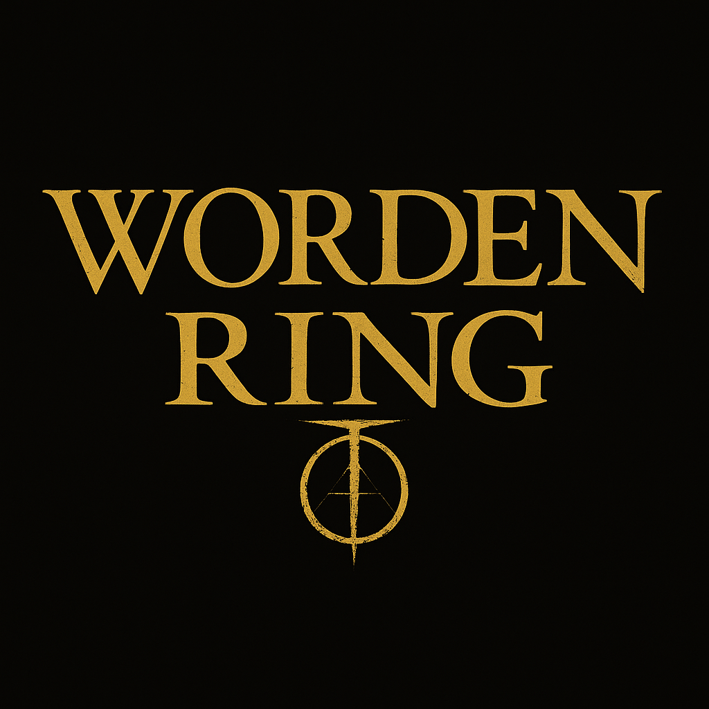
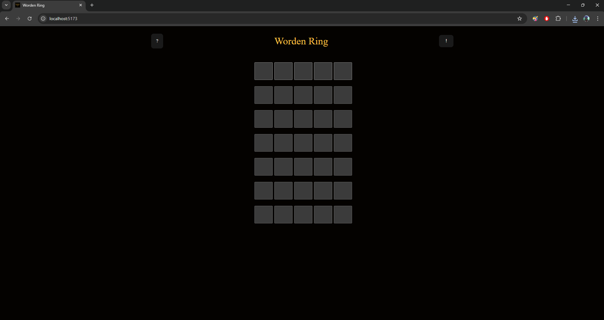

# 🕹️ Worden Ring

> *“A twisted reflection of Wordle, reborn in the Lands Between.”*

## [You can play here](https://worden-ring-c4by8opim-jose-lucas-projects-b3dfaea8.vercel.app/)

## 📖 About the Project

**Worden Ring** is a word game inspired by the classic [Wordle](https://www.nytimes.com/games/wordle/index.html), but set in the dark and challenging universe of **Elden Ring**.

Players must guess hidden words, names of bosses, locations, weapons, spells, and secrets of the Lands Between, all drawn directly from the [**Elden Ring Fans API**](https://eldenring.fanapis.com/).

⚔️ Harder than Elden Ring itself: you’ll need more than **99 Intelligence**, beyond the game’s very limit.

## ✨ Features

* 🎮 Wordle-inspired gameplay
* 🌍 Words sourced from the [**Elden Ring Fans API**](https://eldenring.fanapis.com/)
* 🟩 Visual feedback with colors:

  * 🟩 Green → Correct letter, correct position
  * 🟨 Yellow → Correct letter, wrong position
  * ⬛ Gray → Incorrect letter
* 🔠 Support for spaces and apostrophes (`'`) — apostrophes are **auto-filled**

## 🖼️ Screenshots

## 📜 License

This project is a **fan game**, created for fun and with no commercial intent.
Elden Ring is the property of **FromSoftware** and **Bandai Namco**.

Licensed under the **MIT License**.

## 👤 Author

Made with ❤️ by **José Lucas**

* 📧 [jlgf.profissional@gmail.com](mailto:jlgf.profissional@gmail.com)
* 🐙 [GitHub](https://github.com/joselucasapp)
